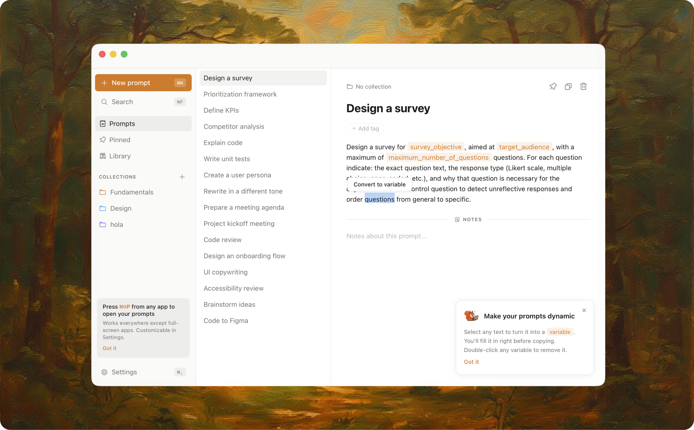

# Stash


A minimalist, offline-first app for saving, organizing, and using AI prompts on macOS.

  

[Website](https://stash.app) · [Releases](https://github.com/Rosqueta/stash/releases) · [Feedback](https://tally.so/r/pb0LZZ)

## Features

- **Offline-first** - No account, no cloud, your prompts stay on your Mac
- **Prompts with structure** - Variables, collections, tags, and notes are built in
- **Global shortcut** - Open your prompt palette from any app on your Mac
- **Warm-up flow** - Fill variables before copying
- **Prompt library** - Browse and import ready-to-use templates
- **Fast and focused** - Search, pin, filter, and keep your best prompts close at hand
- **Built for macOS** - Lightweight, native-feeling, and designed for everyday use

## Screenshot



## Installation

### macOS

1. Download the latest `.dmg` from [Releases](https://github.com/Rosqueta/stash/releases)
2. Open the DMG
3. Drag `Stash` to Applications
4. Open `Stash`

## From Source

**Prerequisites:** Node.js 18+ and Rust

```bash
git clone https://github.com/Rosqueta/stash.git
cd stash
npm install
npm run tauri dev
npm run tauri build
```

## Keyboard Shortcuts

| Shortcut | Action |
| --- | --- |
| `Cmd+Shift+P` | Open global palette |
| `Cmd+N` | New prompt |
| `Cmd+F` | Search prompts |
| `Cmd+,` | Open settings |

## Built With

[Tauri](https://tauri.app/) · [React](https://react.dev/) · [TypeScript](https://www.typescriptlang.org/) · [Tailwind CSS](https://tailwindcss.com/)

## Contributing

Feedback, issues, and small improvements are welcome. For larger changes, please open an issue first.

## License

MIT
